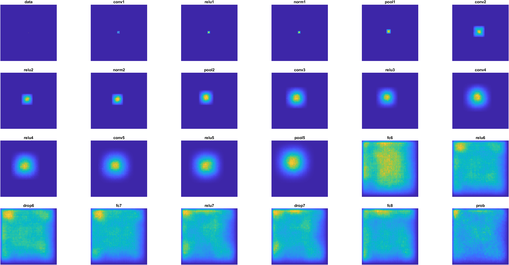

# grad_RF_estim_matlab
Gradient based RF estimation for CNN units in matlab DL framework

## Functions
- `mapReceptiveField`: estimate the receptive field of the center CNN unit for all layers. High-level function, calls `gradientMap_batch` and `get_layer_shape`.
- `gradientMap_batch`: estimate the gradient map of a CNN unit for a batch of images $\partial y/\partial I$. 
- `gradientMap`: estimate the gradient map of a CNN unit for a single image $\partial y/\partial I$, inspired by [1]. 
- `get_layer_shape`: get the output shape of one / all CNN layer(s) in a `dlnetwork` object.

[1]: https://www.mathworks.com/help/deeplearning/ug/investigate-classification-decisions-using-gradient-attribution-techniques.html


## Example
```matlab
% load data
netname = "alexnet";
net = alexnet;
lgraph = layerGraph(net);
lgraph = removeLayers(lgraph, lgraph.Layers(end).Name);
dlnet = dlnetwork(lgraph);
%%
layerNames = {dlnet.Layers.Name}; % ["conv2d_1", "conv2d_2", "conv2d_3"]; % Specify the layer names
inputSize = [256, 256, 3]; % Specify the input size
repN = 100; % Specify the number of input images
device = 'gpu'; % Specify the device ('cpu' or 'gpu')
tic
[RFmaps, fig] = mapReceptiveField(dlnet, layerNames, inputSize, repN, device);
toc
exportgraphics(gcf,netname+"_rf.png")
exportgraphics(gcf,netname+"_rf.pdf")
save(netname+"_RFmaps.mat","RFmaps")
```
Example output for AlexNet: 

